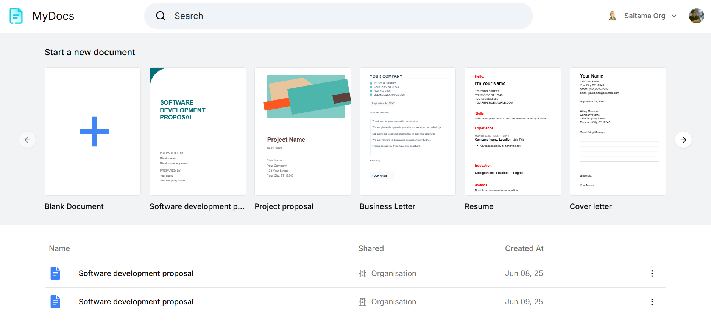

# MyDocs



This is a collaborative document editing app built with [Next.js](https://nextjs.org), powered by [Convex](https://convex.dev) for real-time backend data and [Clerk](https://clerk.com) for authentication. The app enables multiple users to edit documents together in real time, making it ideal for teams (organisation mode) and individuals (personal mode) who need seamless, collaborative text editing.

## Try it out

[MyDocs](https://my-docs-blue.vercel.app/)

## Features
  
* 🖼️ **Real-time Collaboration UI:** See cursors and edits live across users. 


* 🔔 **Comments & Notifications:** Inline comments with mention notifications.


* 📑 **Organisation & Personal Sharing Modes:** Switch between personal and team document spaces.
  
 


## Getting Started

First, install dependencies:

```bash
npm install
```

Then, start the Convex backend in a separate terminal:

```bash
npx convex dev
```

Then, run the development server:

```bash
npm run dev
```

Open [http://localhost:3000](http://localhost:3000) in your browser to see the app.

## Configuration

Create a `.env.local` file and set the following environment variables:

* `NEXT_PUBLIC_CONVEX_URL` – Your Convex deployment URL.
* Clerk environment variables as required by [Clerk's Next.js integration](https://clerk.com/docs/quickstarts/nextjs).

## Project Structure

* `src/` – Main application source code.
* `convex/` – Convex backend functions and schema.
* `public/` – Static assets and SVG icons.
